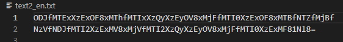

English | [繁體中文](README_TCH.md)
# [Online Tool](https://jingshing.com/encrypt_decrypt/)
You can use this tool on [my website](https://jingshing.com/encrypt_decrypt/).

# Update
I made a new version in html with javascript you can see [repo here](https://github.com/JingShing/Encryptor-Decryptor-JS).

It is lighter and easier to use. With your browser it can easily encrypt and decrypt.

# Encryptor-Decryptor
A tool for encrypt and decrypt.

# [Tutorial Video](https://youtu.be/TyIL7XjMUaw?t=180)

# tutorial
* Import file.
* Put key in text box.
* Select function you need. And press button. It will save file automatically.

# UI

## test file

## After encrypt

## After encrypt and After decrypt

## Principle
It combines the key and the line you want to encrypt. And then turned it into base64 format.
