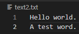

English | [繁體中文](README_TCH)
# Encryptor-Decryptor
A tool for encrypt and decrypt.

# tutorial
* Import file.
* Put key in text box.
* Select function you need. And press button. It will save file automatically.

# UI

## test file

## After encrypt

## After encrypt and After decrypt

