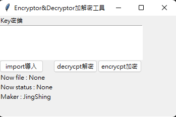
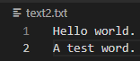
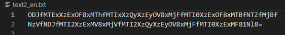
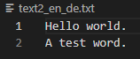

[English](README.md) | 繁體中文
# [線上工具](https://jingshing.com/encrypt_decrypt/)
你可以在 [我的網站](https://jingshing.com/encrypt_decrypt/) 使用這個工具。
# 更新
我用 Html 和 javascript 重寫了這個加密和解密的工具，詳情可以 [看這篇 repo](https://github.com/JingShing/Encryptor-Decryptor-JS).

它更加輕量化且方便使用了。直接以瀏覽器開啟便能使用。
# Encryptor-Decryptor加解密工具
一個協助加解密的工具。

# [教學影片](https://youtu.be/TyIL7XjMUaw?t=180)

# 使用教學
* 導入檔案
* 將金鑰放到文字框
* 選擇要使用的功能，按下按鈕。程式會自動新增一個加解密後的檔案

# UI

## 測試檔案

## 加密後

## 解密加密後的檔案

## 原理
結合密鑰和要加密的內容，將其轉換為base64的格式。
